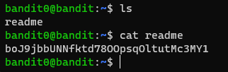

# Level 0 -> 1

### Challenge Link: [Level 0](http://overthewire.org/wargames/bandit/bandit0.html)

### Challenge Text

```The password for the next level is stored in a file called readme located in the home directory. Use this password to log into bandit1 using SSH. Whenever you find a password for a level, use SSH (on port 2220) to log into that level and continue the game.```

### Solution
After logging into the bandit0 user, run `ls` command to see the content of current directory.<br>
The output showed the file named `readme`.<br>
Use `cat readme` to read content inside.


