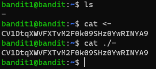

# Level 1 -> 2

### Challenge Link: [Level 2](http://overthewire.org/wargames/bandit/bandit2.html)

### Challenge Text

```The password for the next level is stored in a file called - located in the home directory```

### Solution
After logging into bandit1, we can find a file named `-` and as mentioned in the challenge text that password is in the file called `-` located in the home dir.<br>
We can read content of the file either by `cat <-` or `cat ./-`<br>
In order to read files that start with a dash, we have to redirect them to stdin with the `<` operator.

