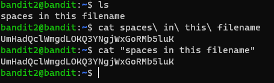

# Level 2 -> 3

### Challenge Link: [Level 3](http://overthewire.org/wargames/bandit/bandit3.html)

### Challenge Text

```The password for the next level is stored in a file called spaces in this filename located in the home directory```

### Solution
To read files with spaces in their name we have to put the filename in quotation marks or use escape sequence otherwise `cat` command try to find multiple files.

`cat "spaces in this filename"` and `cat spaces\ in\ this\ filename` will do the job

