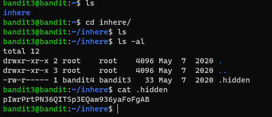

# Level 3 -> 4

### Challenge Link: [Level 4](http://overthewire.org/wargames/bandit/bandit4.html)

### Challenge Text

```The password for the next level is stored in a hidden file in the inhere directory.```

### Solution
It is given that password is in a hidden file in `inhere` dir.<br>
First, we will change directory to `inhere` using `cd inhere`.
As we know that hidden files starts with `.` (dot)<br>
We can use `ls -al` to list out all the files including hidden files.
There we can see a file named `.hidden`<br>
`cat .hidden` will show password.

