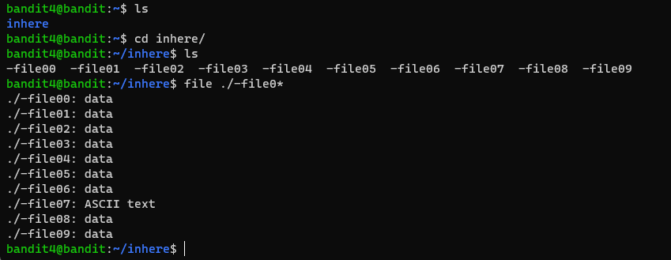

# Level 4 -> 5

### Challenge Link: [Level 4](http://overthewire.org/wargames/bandit/bandit4.html)

### Challenge Text

```The password for the next level is stored in the only human-readable file in the inhere directory.```<br>
```Tip: if your terminal is messed up, try the “reset” command.```

### Solution
After logging into bandit4 we found lots of file inside `inhere` directory.<br>
Challenge text says that password is in one of the `human-readable` file.<br>
We can use [file](https://man7.org/linux/man-pages/man1/file.1.html) command to find file format.
I've used wildcard to automate the boring stuff, we can see `-file07` is the only file contains `ASCII text` that is human-readable.

