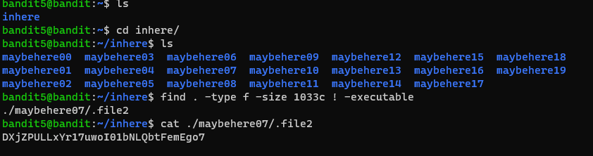

# Level 5 -> 6

### Challenge Link: [Level 6](http://overthewire.org/wargames/bandit/bandit6.html)

### Challenge Text

```The password for the next level is stored in a file somewhere under the inhere directory and has all of the following properties:```

- ```human-readable```
- ```1033 bytes in size```
- ```not executable```

### Solution
In the home directory there is a `inhere` folder which contains more folders which contains files with spaces in filename and hidden file.<br>
Looking at hints given in challenge text, we have to find a human-readable file which have 1033 byte in size and is not executable.

We can use [`find`](https://man7.org/linux/man-pages/man1/find.1.html) command to locate file with following properties.

I have used following command to locate:
```find . -type f -size 1033c ! -executable```

