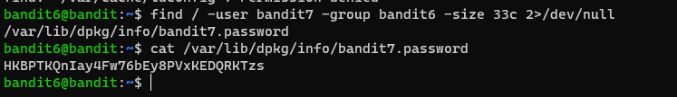

# Level 6 -> 7

### Challenge Link: [Level 6](http://overthewire.org/wargames/bandit/bandit6.html)

### Challenge Text

```The password for the next level is stored somewhere on the server and has all of the following properties:```

- `owned by user bandit7`
- `owned by group bandit6`
- `33 bytes in size`
### Solution
It similar to previous challenge, some important points to focus upon are:
- file (password) is somewhere on the server
- owned by user bandit7
- owned by group bandit6
- it is 33 bytes in size

We can use [`find`](https://man7.org/linux/man-pages/man1/find.1.html) command to locate file with following properties.

I have used following command to locate:<br>
```find / -user bandit7 -group bandit6 -size 33c 2>/dev/null```

`/` : Look for file in whole server (`/` means root dir)<br>
`-user` : flag to mention user who own file<br>
`-group` : flag to mention group who own file<br>
`-size` : flag to mention size of file<br>
`2>/dev/null` : redirect `stderr` to a black hole 😅

