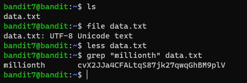

# Level 7 -> 8

### Challenge Link: [Level 8](http://overthewire.org/wargames/bandit/bandit8.html)

### Challenge Text

```The password for the next level is stored in the file data.txt next to the word millionth```

### Solution
After logging into bandit7 we can find `data.txt` that contains lots of lines all having similar structure, every line contains a word followed by spaces and then a possible password.

We can use [`grep`](https://man7.org/linux/man-pages/man1/grep.1.html) command to find line containing word `millionth`.

Following command will do the job:<br>
```grep "millionth" data.txt```

