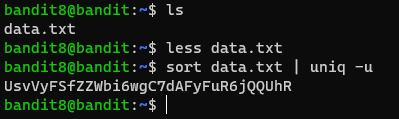

# Level 8 -> 9

### Challenge Link: [Level 9](http://overthewire.org/wargames/bandit/bandit9.html)

### Challenge Text

```The password for the next level is stored in the file data.txt and is the only line of text that occurs only once```

### Solution
We can find `data.txt` in home directory of bandit8.
This file contains lots of possible passwords.

But, correct password is not repeating one.
I have used [`sort`](https://man7.org/linux/man-pages/man1/sort.1.html) command to sort lines alphabetically and then used [`uniq`](https://man7.org/linux/man-pages/man1/uniq.1.html) to remove all the duplicate text from the output.


