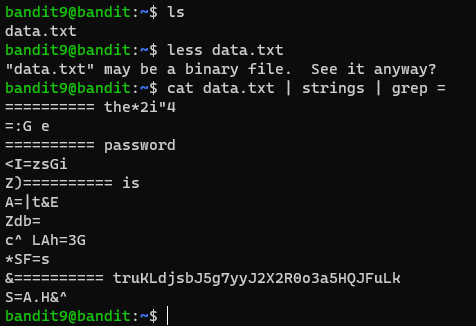

# Level 9 -> 10

### Challenge Link: [Level 10](http://overthewire.org/wargames/bandit/bandit10.html)

### Challenge Text

```The password for the next level is stored in the file data.txt in one of the few human-readable strings, preceded by several ‘=’ characters.```

### Solution
There is a file `data.txt` in the home directory of bandit9.

It is a binary file containing some strings, according to the challenge text password is one of the human-readable strings that is preceded by several '=' characters.

We can use [`strings`]() command to extract plain text out of binary mess.

There are still many strings, we can further filter using `grep`.

Following command will do the job:
`cat data.txt | strings | grep =`


