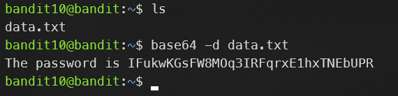

# Level 10 -> 11

### Challenge Link: [Level 11](http://overthewire.org/wargames/bandit/bandit11.html)

### Challenge Text

```The password for the next level is stored in the file data.txt, which contains base64 encoded data```

### Solution
There is a `data.txt` file that contains base64 encoded data.The answer seems obvious, we have to decode the base64 encoded data. 

We can use [base64](https://man7.org/linux/man-pages/man1/base64.1.html) linux command to decode the base64 encoded data.


